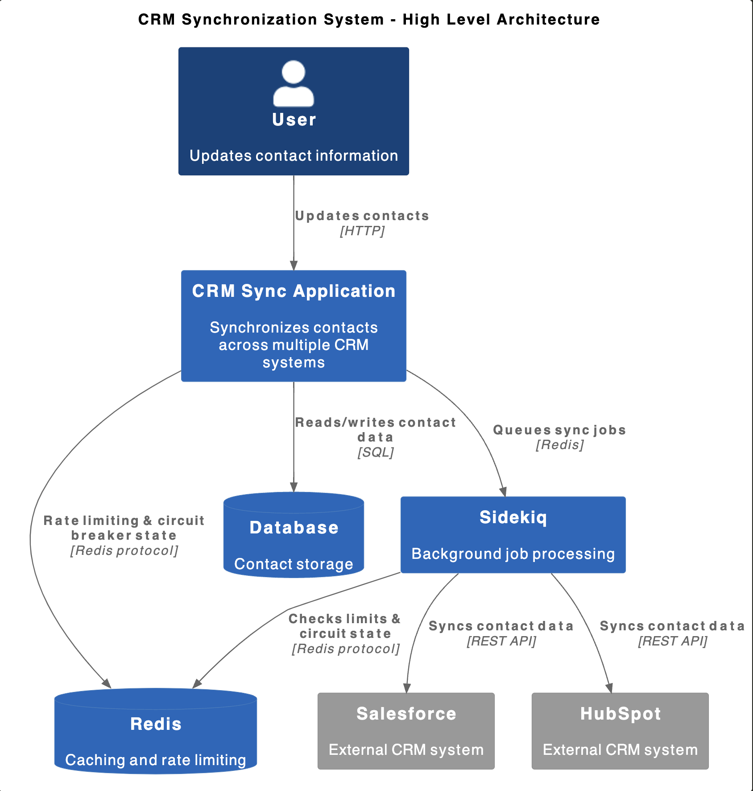
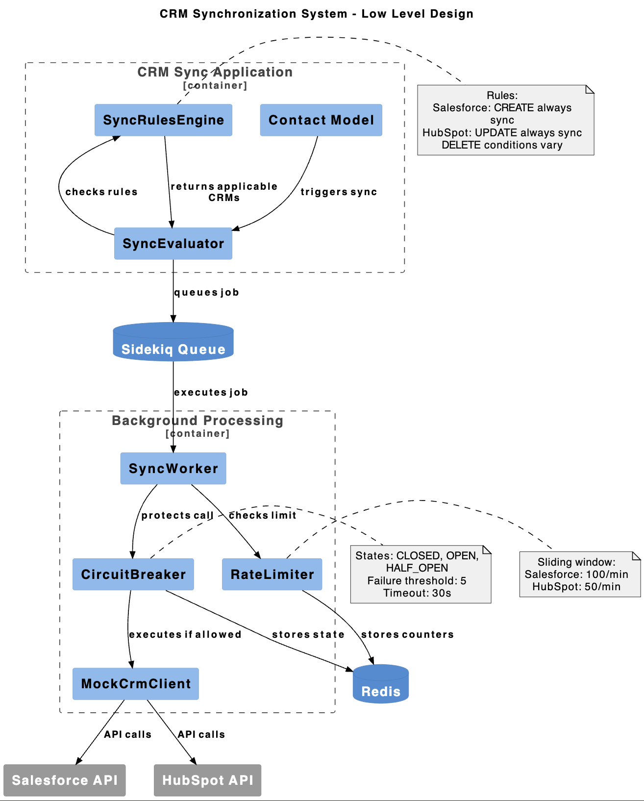

# Sync Service - Context & Solution
[Problem Documentation](problem.md)

## Problem Analysis

The core challenge is handling 300M daily sync requests (3500 req/sec) while respecting external CRM rate limits. After analyzing the requirements, I believe the most critical sub-problem: **rate-limited queue processing with circuit breaker protection**.

## Selected Sub-Problem
Rate-limited queue processing with circuit breaker protection

### Assumption
- Let's assume we need to sync lead/contact info from internal to external systems. Let's take Salesforce and HubSpot as CRM examples. Assume external CRMs have strict API rate limits(100 req/sec Salesforce, 50 req/sec HubSpot)
- Need to prevent cascade failures when CRMs go down
- Must coordinate rate limiting across multiple worker instances

## Architecture Decisions

### Technology Stack
- **Ruby/Rails**: Rapid development, good for demonstration
- **Sidekiq**: Battle-tested job processing
- **Redis**: Rate limiting and circuit breaker state. Given Rails is chosen as demonstration stack, redis is industry standard.
- **PostgreSQL**: Sync status and configuration. In general we should look at NoSQL for handling unstructured/semi-structured data at scale and SQL for structured data.

### Trade-offs Made
- **Ruby vs Go**: Chose Ruby for faster implementation despite performance trade-offs
- **Simple CDC**: Rails callbacks instead of complex database triggers
- **Mock transformations**: Focus on rate limiting, not schema mapping
- **In-memory circuit breaker**: Simpler than distributed consensus

### Data Model - Assume contacts data to be synced from internal to external systems
```json
contact = {
  "id": "12345",
  "email": "john@acme.com",
  "first_name": "John",
  "last_name": "Doe", 
  "company": "Acme Corp",
  "status": "active"
}
```

## High-Level Design

```

```

## Assumptions

### Scale
- 300M requests/day = 3500 req/sec average
- Single instance handles 500 req/sec
- Need 10+ instances for full scale

### CRM Limits
- Salesforce: 100 req/sec (need 25 enterprise accounts)
- HubSpot: 50 req/sec (need 25 enterprise accounts)

## Core Components

1. **SyncWorker**: Processes individual sync requests
2. **RateLimiter**: Enforces per-CRM rate limits using Redis
3. **CircuitBreaker**: Prevents cascade failures
4. **RetryHandler**: Exponential backoff for failed requests

## 🔧 LLD



### 1. **SyncWorker** - Main Processing Engine
```ruby
class SyncWorker
  # Processes sync requests with rate limiting and circuit breaker protection
  # Handles retries with exponential backoff
  # Supports multiple CRM providers
end
```

### 2. **RateLimiter** - Traffic Control
```ruby
class RateLimiter
  # Sliding window algorithm with Redis
  # Per-CRM configurable limits
  # Distributed across worker instances
end
```

### 3. **CircuitBreaker** - Failure Protection
```ruby
class CircuitBreaker
  # States: closed → open → half-open
  # Auto-recovery after timeout
  # Prevents cascade failures
end
```

### 4. **SyncRulesEngine** - Business Logic
```ruby
RULES = {
  'salesforce' => { 'CREATE' => 'always', 'UPDATE' => 'active_only' },
  'hubspot' => { 'CREATE' => 'has_company', 'UPDATE' => 'always' }
}
```

### Sync Rules
- **Salesforce**: All creates, updates only for active contacts
- **HubSpot**: Creates with company attribute in contact records, and all updates
- **Priority**: CREATE > UPDATE > DELETE

## Implementation Approach

### Rate Limiting Strategy
Using sliding window algorithm with Redis:
- Track request timestamps per CRM
- Remove old timestamps outside window
- Allow request if under limit

### Circuit Breaker Pattern
Three states: **closed → open → half-open**
- Track failures per CRM
- Open circuit after 5 consecutive failures
- Auto-recover after 30 seconds

### Retry Logic
Exponential backoff with jitter to prevent thundering herd and max delay cap:
- **Base delay**: 1 second
- **Max delay**: 60 seconds
- **Max attempts**: 3

## Testing Strategy
- Unit tests for rate limiter logic
- Integration tests with mock CRMs
- Load tests demonstrating 1000 req/sec
- Failure simulation for circuit breaker


## Technical Specifications

```bash
**Current Performance**:
- 400-700 req/sec per instance
- Target: 1000+ req/sec
- Scale path: 5+ instances for 300M daily

**Rate Limits**:
- Salesforce: 100 req/sec
- HubSpot: 50 req/sec
- Redis-based distributed limiting

**Circuit Breaker**:
- Failure threshold: 5 consecutive failures
- Timeout: 30 seconds auto-recovery
- Per-CRM independent state
```

## Testing Strategy

### Load Tests
1. **`load_test.rb`** - Basic throughput (500 contacts)
2. **`table_test.rb`** - All failure scenarios 

### Test Results
```
 Performance: 416.7 req/sec (current)
 Success patterns working
 Rate limiting effective  
 Circuit breaker protecting from failures
```

**Technology Stack**:
- Ruby/Rails + Sidekiq for job processing
- Redis for rate limiting and circuit state
- PostgreSQL for data persistence
- Mock CRM clients for testing
